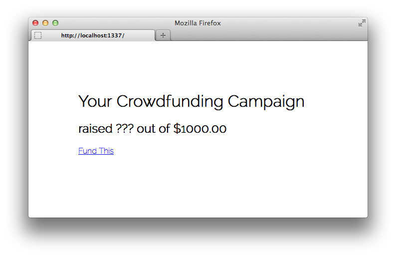
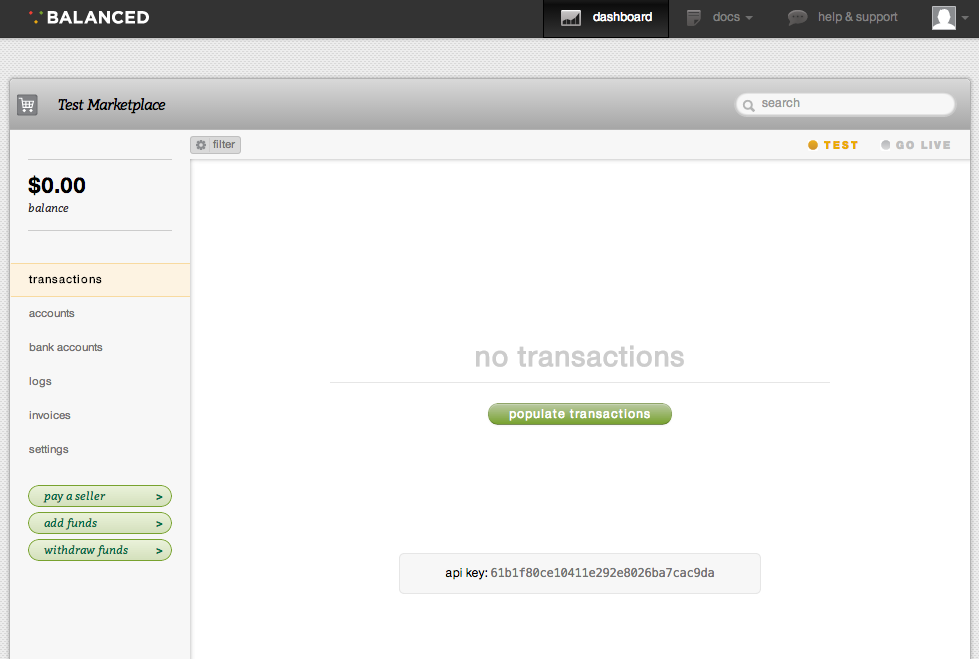
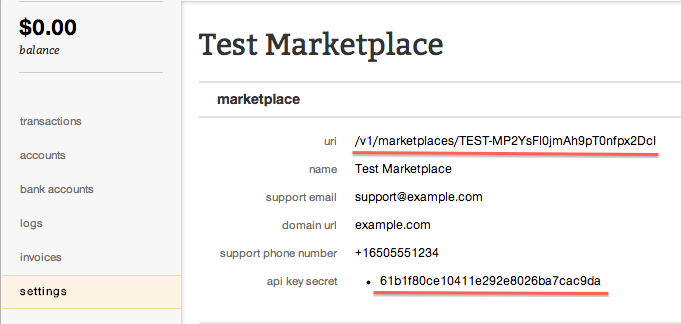
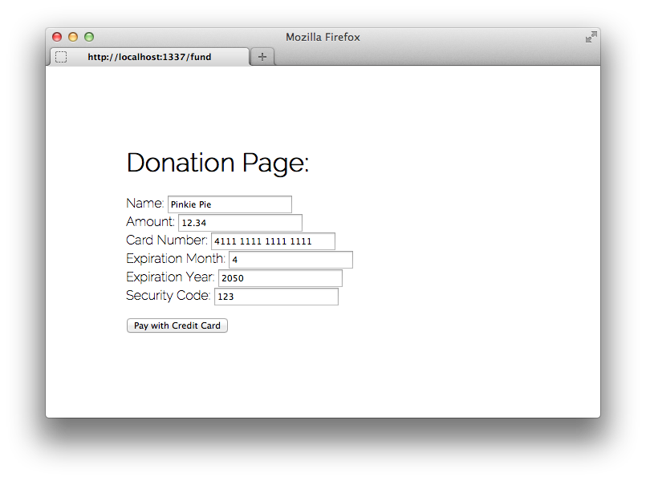
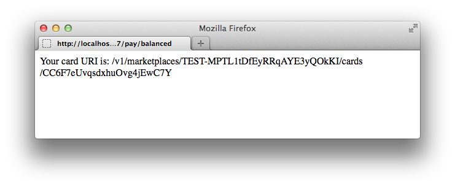
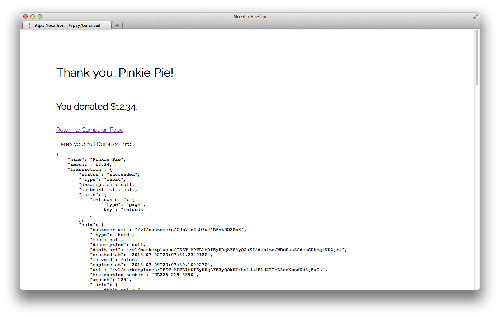
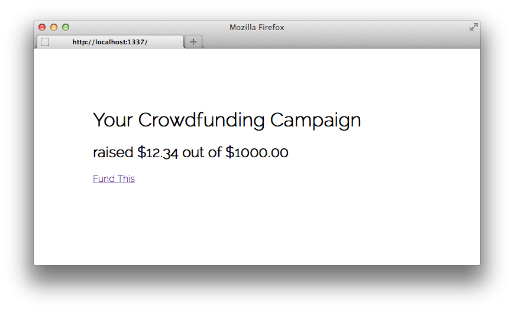

So You Wanna Build a Crowdfunding Site
===

**The tools to get funded by the crowd, should belong to the crowd.**

That's why I want to show you how to roll your own crowdfunding site, <i>in less than 300 lines of code</i>. 
Everything in this tutorial is open source, and we'll only use other open-source technologies,
such as Node.js, MongoDB, and Balanced Payments.

**Here's the [Live Demo](https://crowdtuts-1.herokuapp.com/).**
All source code and tutorial text is [Unlicensed](http://unlicense.org/).

0. Quick Start
---

If you just want the final crowdfunding site, clone this repo and go to the `/demo` folder.
All you need to do is set your configuration variables, and you're ready to go!
For everyone who wants the nitty gritty details, carry on.

1. Setting up a basic Node.js app with Express
---

If you haven't already done so, you'll need to [install Node.js](http://nodejs.org/). (duh)

Create a new folder for your app.
We'll be using the [Express.js framework](http://expressjs.com/) to make things a lot more pleasant.
To install the Express node module, run this on the command line inside your app's folder:
	
	npm install express

Next, create a file called `app.js`, which will be your main server logic.
The following code will initialize a simple Express app,
which just serves a basic homepage and funding page for your crowdfunding site.

	// Configuration
	var CAMPAIGN_GOAL = 1000; // Your fundraising goal, in dollars

	// Initialize an Express app
	var express = require('express');
	var app = express();
	app.use("/static", express.static(__dirname + '/static')); // Serve static files
	app.use(express.bodyParser()); // Can parse POST requests
	app.listen(1337); // The best port
	console.log("App running on http://localhost:1337");

	// Serve homepage
	app.get("/",function(request,response){

		// TODO: Actually get fundraising total
	    response.send(
	    	"<link rel='stylesheet' type='text/css' href='/static/fancy.css'>"+
	        "<h1>Your Crowdfunding Campaign</h1>"+
	        "<h2>raised ??? out of $"+CAMPAIGN_GOAL.toFixed(2)+"</h2>"+
	        "<a href='/fund'>Fund This</a>"
	    );

	});

	// Serve funding page
	app.get("/fund",function(request,response){
		response.sendfile("fund.html");
	});

Create another file named `fund.html`. This will be your funding page.

	<link rel='stylesheet' type='text/css' href='/static/fancy.css'>
	<h1>Donation Page:</h1>

Optionally, you may also include a stylesheet at `/static/fancy.css`,
so that your site doesn't look Hella Nasty for the rest of this tutorial.

	@import url(https://fonts.googleapis.com/css?family=Raleway:200);
	body {
		margin: 100px;
		font-family: Raleway; /* Sexy font */
		font-weight: 200;
	}

Finally, run `node app` on the command line to start your server!

Check out your crowdfunding site so far at `http://localhost:1337`.

The homepage will display the Campaign Goal you set in the Configuration section of `app.js`.
The donations page isn't functional yet, so in the following chapters,
I'll show you how to accept and aggregate credit card payments from your wonderful backers.

2. Getting started with Balanced Payments
---

[Balanced Payments](https://www.balancedpayments.com/) isn't just another payments processor.
They've open sourced their whole site, their chat logs are publicly available, and they even discuss their roadmap in the open.
[These people *get* openness.](http://www.fastcolabs.com/3008944/open-company/why-i-made-my-payments-startup-an-open-company)

Best of all, you don't even need to sign up to get started with Balanced!

[Just go to this link](https://www.balancedpayments.com/marketplaces/start),
and they'll generate a brand-new Test Marketplace for you,
that you can claim with an account afterwards.
Remember to keep this tab open, or save the URL, so you can come back to your Test Marketplace later.

Click the Settings tab in the sidebar, and note your Marketplace URI and API Key Secret.

Copy these variables to the Configuration section of `app.js` like this:

	// Configuration
	var BALANCED_MARKETPLACE_URI = "/v1/marketplaces/TEST-YourMarketplaceURI";
    var BALANCED_API_KEY = "YourAPIKey";
	var CAMPAIGN_GOAL = 1000; // Your fundraising goal, in dollars

Now, let's switch back to `fund.html` to create our actual payment page.

First, we'll include and initialize [Balanced.js](https://docs.balancedpayments.com/current/overview?language=bash#tokenizing-sensitive-information).
This Javascript library will securely tokenize the user's credit card info, so your server never has to handle the info directly.
Meaning, you will be free from PCI regulations.
Append the following code to `fund.html`, replacing `BALANCED_MARKETPLACE_URI` with your actual Marketplace URI:

	<!-- Remember to replace BALANCED_MARKETPLACE_URI with your actual Marketplace URI! -->
	
	

Next, create the form itself, asking for the user's Name, the Amount they want to donate, and other credit card info.
We will also add a hidden input, for the credit card token that Balanced.js will give us.
The form below comes with default values for a test Visa credit card.
Append this to `fund.html`:

	<form id="payment_form" action="/pay/balanced" method="POST">

		Name: <input name="name" value="Pinkie Pie"/>  
		Amount: <input name="amount" value="12.34"/>  
		Card Number: <input name="card_number" value="4111 1111 1111 1111"/>  
		Expiration Month: <input name="expiration_month" value="4"/>  
		Expiration Year: <input name="expiration_year" value="2050"/>  
		Security Code: <input name="security_code" value="123"/>  

		<!-- Hidden inputs -->
		<input type="hidden" name="card_uri"/>

	</form>
	<button onclick="charge();">
		Pay with Credit Card
	</button>

Notice the Pay button does not submit the form directly,
but calls a `charge()` function instead, which we are going to implement next.
The `charge()` function will get the credit card token from Balanced.js, 
add it as a hidden input, and submit the form.
Append this to `fund.html`:

	

This form will send a POST request to `/pay/balanced`, which we will handle in `app.js`.
For now, we just want to display the card token URI.
Paste the following code at the end of `app.js`:

	// Pay via Balanced
	app.post("/pay/balanced",function(request,response){

		// Payment Data
		var card_uri = request.body.card_uri;
		var amount = request.body.amount;
		var name = request.body.name;

		// Placeholder
		response.send("Your card URI is: "+request.body.card_uri);

	});

Restart your app, (Ctrl-C to exit, then `node app` to start again) and go back to `http://localhost:1337`.

Your payment form should now look like this:

The default values for the form will already work, so just go ahead and click Pay With Credit Card.
(Make sure you've replaced `BALANCED_MARKETPLACE_URI` in `fund.html` with your actual Test Marketplace's URI!)
Your server will happily respond with the generated Card URI Token.

Next up, we will use this token to actually charge the given credit card!

3. Charging cards through Balanced Payments
---

Before we charge right into this, (haha) let's install two more Node.js modules for convenience.

Run the following in the command line:

`npm install request` A library for simplified HTTP requests.

`npm install q` A [Promises](http://howtonode.org/promises) library, to pleasantly handle asynchronous calls and avoid Callback Hell.

Because we'll be making multiple calls to Balanced, let's also create a helper method.
The following function returns a Promise that the Balanced API has responded to whatever HTTP Request we just sent it.
Append this code to `app.js`:

	// Calling the Balanced REST API
	var Q = require('q');
	var httpRequest = require('request');
	function _callBalanced(url,params){

		// Promise an HTTP POST Request
		var deferred = Q.defer();
		httpRequest.post({
			
			url: "https://api.balancedpayments.com"+BALANCED_MARKETPLACE_URI+url,
			auth: {
				user: BALANCED_API_KEY,
				pass: "",
				sendImmediately: true
			},
			json: params

		}, function(error,response,body){

			// Handle all Bad Requests (Error 4XX) or Internal Server Errors (Error 5XX)
			if(body.status_code>=400){
				deferred.reject(body.description);
				return;
			}
			
			// Successful Requests
			deferred.resolve(body);

		});
		return deferred.promise;

	}

Now, instead of just showing us the Card Token URI when we submit the donation form, we want to:

1. Create an account with the Card URI
2. Charge said account for the given amount (note: you'll have to convert to cents for the Balanced API)
3. Record the transaction in the database (note: we're skipping this for now, and covering it in the next chapter)
4. Render a personalized message from the transaction

Replace the `app.post("/pay/balanced", ... );` callback from the previous chapter with this:

	// Pay via Balanced
	app.post("/pay/balanced",function(request,response){

		// Payment Data
		var card_uri = request.body.card_uri;
		var amount = request.body.amount;
		var name = request.body.name;

		// TODO: Charge card using Balanced API
		/*response.send("Your card URI is: "+request.body.card_uri);*/

		Q.fcall(function(){

			// Create an account with the Card URI
			return _callBalanced("/accounts",{
				card_uri: card_uri
			});

		}).then(function(account){

			// Charge said account for the given amount
			return _callBalanced("/debits",{
				account_uri: account.uri,
				amount: Math.round(amount*100) // Convert from dollars to cents, as integer
			});

		}).then(function(transaction){

			// Donation data
			var donation = {
				name: name,
				amount: transaction.amount/100, // Convert back from cents to dollars.
				transaction: transaction
			};

			// TODO: Actually record the transaction in the database
			return Q.fcall(function(){
				return donation;
			});

		}).then(function(donation){

			// Personalized Thank You Page
			response.send(
	    		"<link rel='stylesheet' type='text/css' href='/static/fancy.css'>"+
				"<h1>Thank you, "+donation.name+"!</h1>  "+
				"<h2>You donated $"+donation.amount.toFixed(2)+".</h2>  "+
				"<a href='/'>Return to Campaign Page</a>  "+
				" "+
				"Here's your full Donation Info:  "+
				"<pre>"+JSON.stringify(donation,null,4)+"</pre>"
			);

		},function(err){
			response.send("Error: "+err);
		});

	});

Now restart your app, and pay through the Donation Page once again.
(Note: To cover processing fees, you have to pay more than $0.50 USD)
This time, you'll get a full Payment Complete page, with personalized information!

Furthermore, if you check the transactions tab in your Test Marketplace dashboard,
you should find that money has now been added to your balance.

We're getting close! Next, let's record donations in a MongoDB database.

4. Recording donations with MongoDB
---

[MongoDB](http://mongodb.org) is a popular open-source [NoSQL](http://www.10gen.com/nosql) database.
NoSQL is especially handy for rapid prototyping, because of its dynamic schemas.
In other words, you can just make stuff up on the fly.
This will be useful if, in the future, you want to record extra details about each donation,
such as the donator's email address, reward levels, favorite color, etc.

Start up a MongoDB database, and get its URI. 
You can use a remote database with a service such as [MongoHQ](https://www.mongohq.com/home),
but for this tutorial, let's run MongoDB locally.
[Here are the instructions for installing and running MongoDB on your computer](http://docs.mongodb.org/manual/installation/).

Once you've done that, add the MongoDB URI to your Configuration section at the top of `app.js`.

	// Configuration
	var MONGO_URI = "mongodb://localhost:27017/test";
	var BALANCED_MARKETPLACE_URI = "/v1/marketplaces/TEST-YourMarketplaceURI";
	var BALANCED_API_KEY = "YourAPIKey";
	var CAMPAIGN_GOAL = 1000; // Your fundraising goal, in dollars

Now, let's install the native MongoDB driver for Node.js:

`npm install mongodb`

Add the following code to the end of `app.js`.
This will return a Promise that we've recorded a donation in MongoDB.

	// Recording a Donation
	var mongo = require('mongodb').MongoClient;
	function _recordDonation(donation){

		// Promise saving to database
		var deferred = Q.defer();
		mongo.connect(MONGO_URI,function(err,db){
			if(err){ return deferred.reject(err); }

			// Insert donation
			db.collection('donations').insert(donation,function(err){
	            if(err){ return deferred.reject(err); }

	            // Promise the donation you just saved
				deferred.resolve(donation);

				// Close database
				db.close();

			});
		});
		return deferred.promise;

	}

Previously, we skipped over actually recording a donation to a database.
Go back, and replace that section of code with this:

	// TODO: Actually log the donation with MongoDB
	/*return Q.fcall(function(){
		return donation;
	});*/

	// Record donation to database
	return _recordDonation(donation);

Restart your app, and make another donation.
If you run `db.donations.find()` on your MongoDB instance, you'll find the donation you just logged!

*Just one step left...*

Finally, we will use these recorded donations to calculate how much money we've raised.

5. Completing the Donation
---

Whether it's showing progress or showing off,
you'll want to tell potential backers how much your campaign's already raised.

To get the total amount donated, simply query for all donation amounts from MongoDB, and add them up.
Here's how you do that with MongoDB, with an asynchronous Promise for it.
Append this code to `app.js`:

	// Get total donation funds
	function _getTotalFunds(){

		// Promise the result from database
		var deferred = Q.defer();
		mongo.connect(MONGO_URI,function(err,db){
			if(err){ return deferred.reject(err); }

			// Get amounts of all donations
			db.collection('donations')
			.find( {}, {amount:1} ) // Select all, only return "amount" field
			.toArray(function(err,donations){
				if(err){ return deferred.reject(err); }

				// Sum up total amount, and resolve promise.
				var total = donations.reduce(function(previousValue,currentValue){
					return previousValue + currentValue.amount;
				},0);
				deferred.resolve(total);

				// Close database
				db.close();

			});
		});
		return deferred.promise;

	}

Now, let's go back to where we were serving a basic homepage.
Let's change that, to *actually* calculate your total funds, and show the world how far along your campaign has gotten.

	// Serve homepage
	app.get("/",function(request,response){
	    
	    // TODO: Actually get fundraising total
	    /*response.send(
	        "<link rel='stylesheet' type='text/css' href='/static/fancy.css'>"+
	        "<h1>Your Crowdfunding Campaign</h1>"+
	        "<h2>raised ??? out of $"+CAMPAIGN_GOAL.toFixed(2)+"</h2>"+
	        "<a href='/fund'>Fund This</a>"
	    );*/

		Q.fcall(_getTotalFunds).then(function(total){
			response.send(
				"<link rel='stylesheet' type='text/css' href='/static/fancy.css'>"+
		        "<h1>Your Crowdfunding Campaign</h1>"+
		        "<h2>raised $"+total.toFixed(2)+" out of $"+CAMPAIGN_GOAL.toFixed(2)+"</h2>"+
		        "<a href='/fund'>Fund This</a>"
			);
		});

	});

Restart the app, and look at your final homepage.

*It's... beautiful.*

You'll see that your total already includes the donations recorded from the previous chapter.
Make another payment through the Donations Page, and watch your funding total go up.

Congratulations, you just made your very own crowdfunding site!
